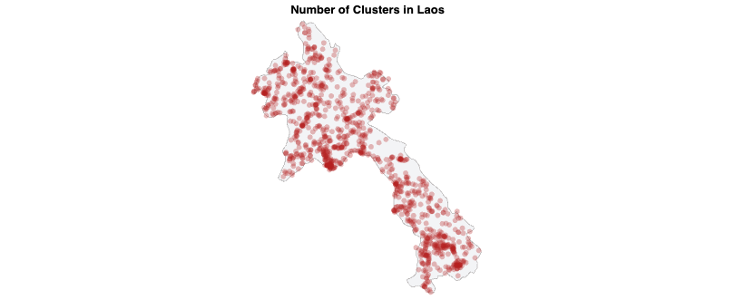

# High temperatures and Child development

{Your Name}

## What is your current goal? Has it changed since the proposal?

Yes it has chenged the other one required more cleaning of the data and too complicated

## Are there data challenges you are facing? Are you currently depending on mock data?

I need to priorize the narrative since is a lot of analysis

## Describe each of the provided images with 2-3 sentences to give the context and how it relates to your goal.

Temperatures are rising, but seeing them alone have high stationality and not clear pattern:

Then if we calculate long time anomalies, as the deviation from trend 2000-2020, we can see a clearer pattern of increase:

Each month have a different pattern, so here we show how to compare it until 2025

First, a map to see the spatial distribution of temperature anomalies:

That shows that temperatures are rising over time even controlling by month, and is not homogeneous on all the world,  so we can analyze that to child development outcomes.

MICS data have information on child development at the cluster georreferenced level and as we merged with temperature exposure at household level, we can analyze the direct impacts. Here is the distribution of clusters in the sample:

To understand the spatial data we have, here are the top3:

Then we can see the relationship between temperature exposure and probability of high stimulation in children.

We can see how children inside the clusters have a differential expositions during their life. Now this could be different by socioeconomic characteristics, impacting early child development indicators (ECDI)

Not much difference by wealth quintiles overall indexes, so a difference in temperature could be a cleaner effect what we see in this approach to the impact of high temperatures over development:

## What form do you envision your final narrative taking? (e.g. An article incorporating the images? A poster? An infographic?)

Final narrative folliwing my paper to introduce it to a broader audience. Indrotucing this topics and then link the paper to provide more technical details.

